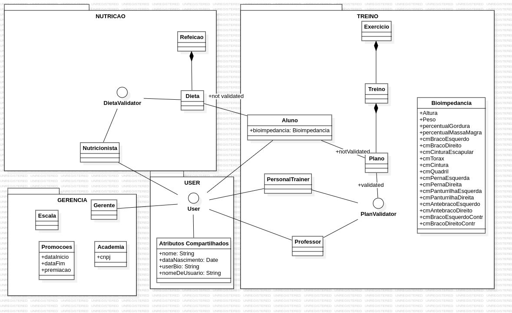

# Kramp, o software para academias.

## MVP 1
### Objetivo: Funcionamento Básico que contempla a possibilidade de profissionais enviarem treinos e dieta para seus alunos ou alunos criarem os seus próprios treinos

## MVP 2
### Objetivo: Foco em Gameficação e se der tempo Implementar Nutricionistas e Academias

## BACK-END

### MVP 1

1. User (interface)
    1. Aluno
    2. Professor
    3. Personal Trainer
    4. Nutricionista
    5. Gerente
2. Academia (Object)
3. Plano (Object)
4. Treino (Object)
5. Exercicio (Object)

## FRONT-END

### Mvp 1

1. Formulário de Login
2. Cadastro de Usuário
    1. Nutricionista (validação de CRN)
    2. Personal trainer e Professor (Validação de CREF)
    3. Gerente (Validação de CNPJ e nome da Academia)
    4. Aluno (Normal)
3. Formulário para Treino
4. Formulário para Plano

